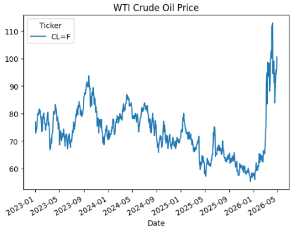
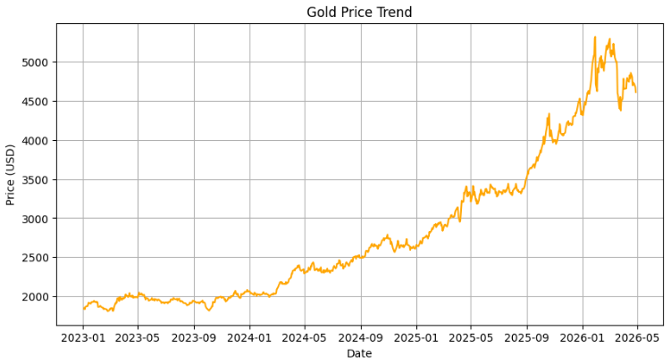
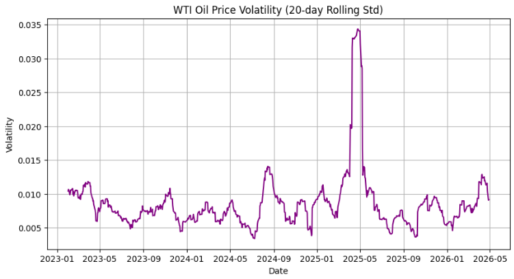
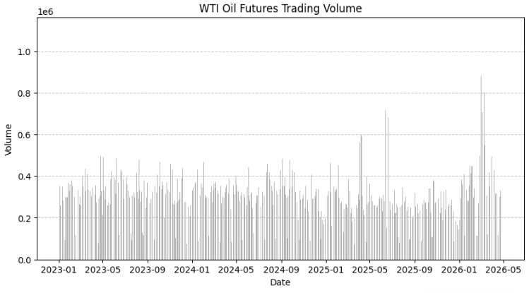
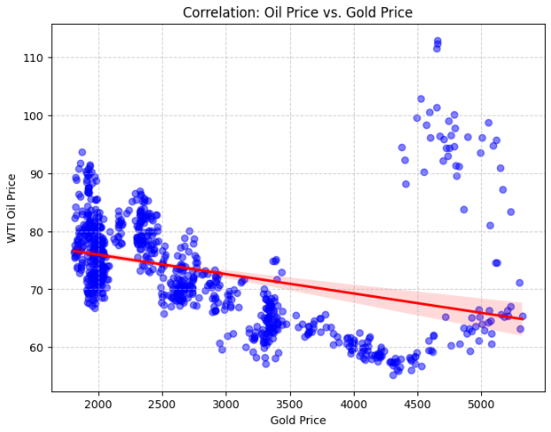
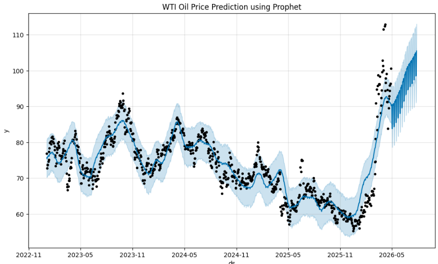
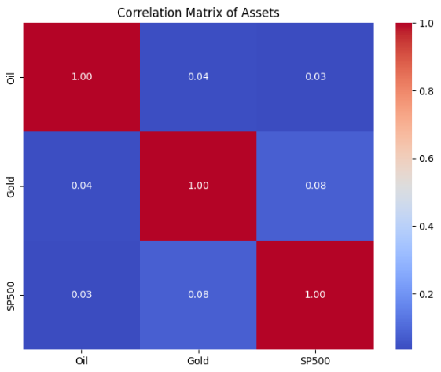
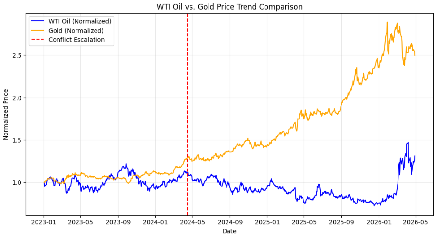
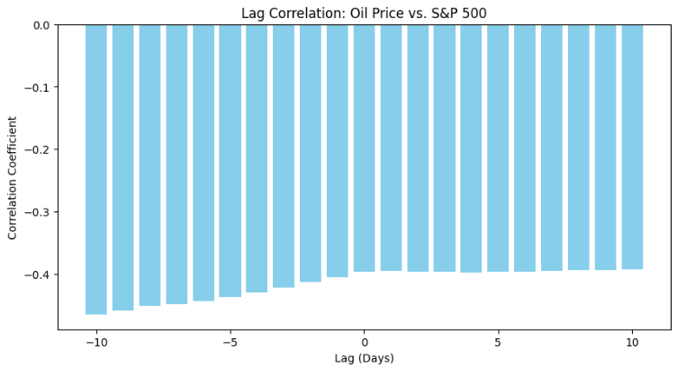
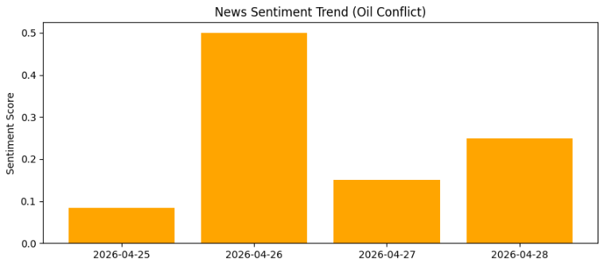

# 📊 美以伊戰爭對全球能源市場影響分析

## 📈 數據分析儀表板

### 1. 市場趨勢 (項目一、二)
| 原油走勢圖 | 黃金走勢圖 |
| :---: | :---: |
|  |  |

### 2. 風險動能 (項目七、九)
| 原油價格波動率 | 原油期貨成交量 |
| :---: | :---: |
|  |  |

### 3. 資產連動與預測
| 油金回歸分析 | AI 價格預測 (Prophet) |
| :---: | :---: |
|  |  |

---

*   **相關矩陣熱點圖**：
*   **油金標準化比較**：
*   **股市與油價滯後相關**：
*   **市場情緒趨勢**：
